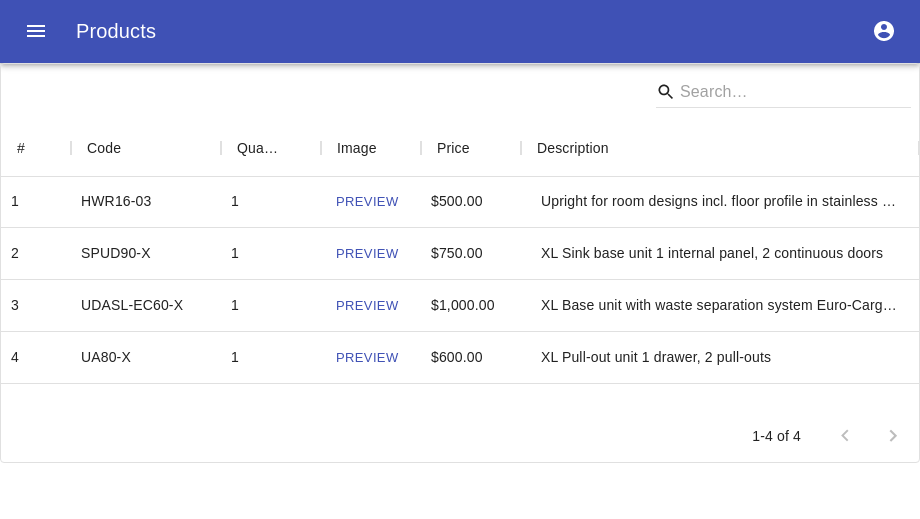
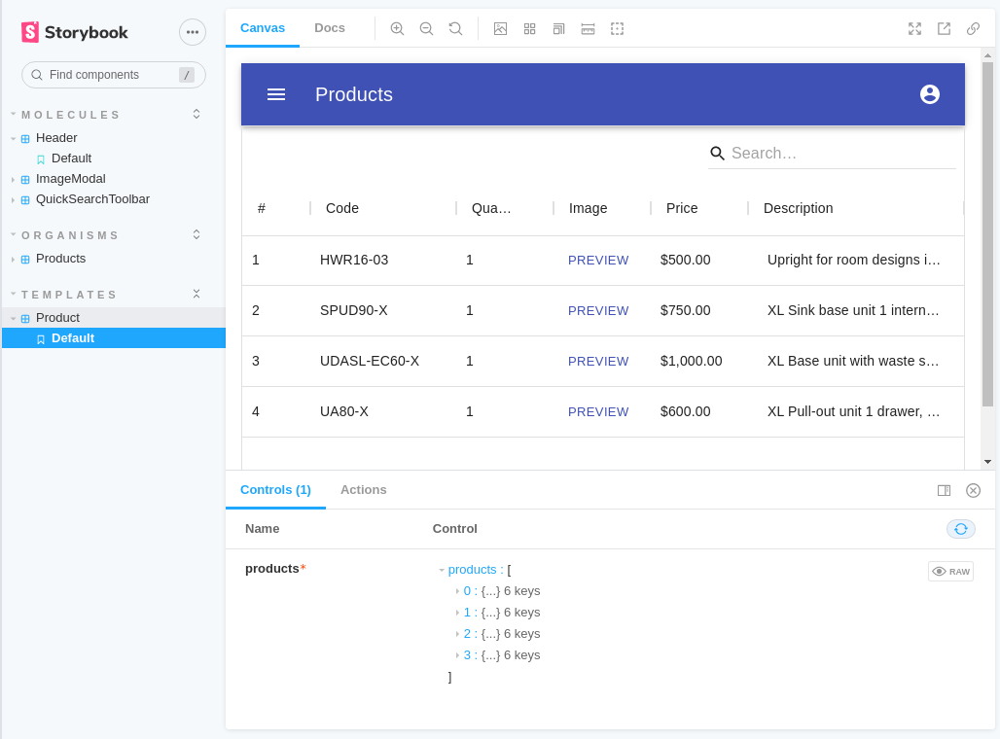

# React Showcase

Simple project to showcase the storybook tool.

## Getting Started

You can use `npm` to install the dependencies of the project. You can run:

```bash
npm ci
```
to install according to `package-lock.json`. In general, do _not_ `npm install` unless you are specifically looking to make updates down the dependency graph in `package-lock.json`.

## Main Page

For running the `App` in the browser:

```bash
npm start
```


## Storybook

For running storybook and being able to interact with the library components:

```bash
npm run storybook
```



## Linting

For linting we are using Airbnb style guideline. To manually run linting:

```bash
npm run lint
```
